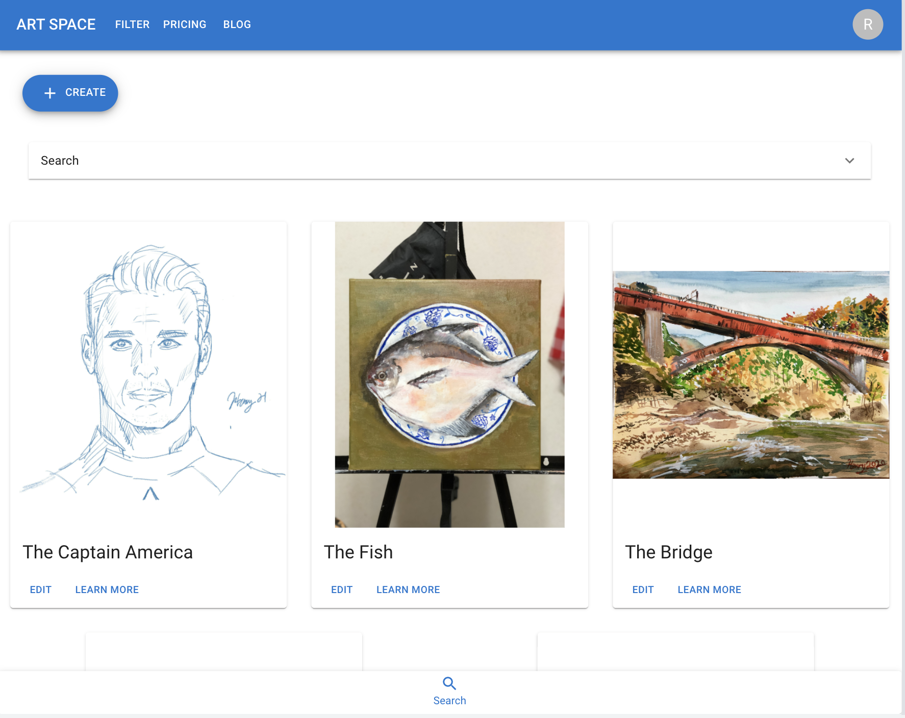
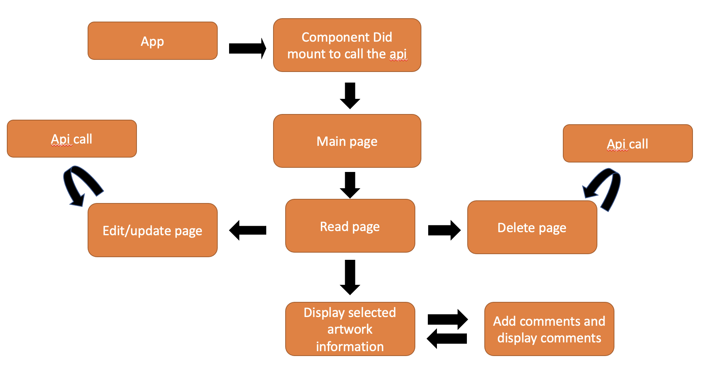

# Project 02 - React Art Space SG

   

## Project Summary

**Context**

The Art Space SG is a mobile-responsive, single page web application that allows creative individual to upload their artwork to online, views, search and promote. There are various different kind of artwork and medium for viewer to explore. There are online portal for artist across the world to share their creative content. However, the vast amount of information on internet makes it hard for user to narrow search for Singaporean made artwork. Singaporean could only make paid visit to physical galleries or wait for yearly routine online art showcase. 

To ease the above pain point, the application would bring gallery to user’s doorstep and is 24/7 experience. 

# Content

1. [Design, UI, and UX](#1-design-ui-and-ux)
2. [Technologies Used](#2-technologies-used)
3. [Backend API](#3-backend-api)
4. [Future Features to Implement](#4-future-features-to-implement)
5. [Testing](#5-testing)
6. [Deployment](#6-deployment)
7. [Acknowledgemnts](#7-acknowledgemnts)

# 1. Design, UI, and UX

### Figma File with the wireframe prototype, can be found at the link below:

[https://www.figma.com/file/UanLFi4XjQ9GSqnMLRsjgq/Material-2-Design-Henry?node-id=1011%3A3346](https://www.figma.com/file/UanLFi4XjQ9GSqnMLRsjgq/Material-2-Design-Henry?node-id=1011%3A3346)

### **Strategy**

**Organizational Goals**

The aim of the application is to build an online community where fine art lovers can view and share their idea and artworks and to show case artwork that are done by our beloved Singaporeans to the world.

**User Goal**

The aim of users is to post their self-made artworks to the website and showcase their talent and creativity to anyone who have great keen interest in art and leave reviews through the virtual art space. 

## Users:

**User Stories**

1. As a user, I want to be able to upload my artwork to internet. so that i can showcase my artwork on the virtual ground.
   Acceptance Criteria: The artwork must be original and no plagiarism act is allow. The artwork url url must be a valid url.

2. As a user, I want to be able to edit/amend my artwork description details and upload to the website again.

3. As a user, I want viewers to be able to add review or comments to my artwork, so that I will be able to know what i can further improve on  

4. As a user, I would like to have a platform where I can promote my artwork, so that I can make income/passive income with my work. 

### **Scope**

_Functional Specifications_
* Search for artwork or sort by category

* Edit/Update artwork

* Delete artwork

_Non-functional requirements_
* Mobile responsiveness
   
* Performance

### **Structure**

* The following is the art space sg application structure diagram

 

* The application will retrieve artwork data from mongo database and display it at the front page of the application.

* When a user enters a search term under the search bar, it will search text base on the artwork title name and description and return the result that matches the search key word. Same for the checkbox and radio in the search accordion, result of the selected checkbox and radio with be returned.

* When user click on the create button, it will lead to the create form page. User can input the details to the form and submit the form by clicking add. 

* When user click on any artwork's edit button, it will lead to the a popout for enter password. If the enter password matches the password store in backend, the edit form page would be shown. 

* When user click on any artwork's learn more button, it will lead user to the read page. The read page would show more in depth details about the artwork. The owner of the artwork would have choice to delete their artwork from art space. By clicking the delete button in the read page, a popout for password would appear and if the input password matches the one in database, artwork will be deleted.

* In the read page, user can enter their comments in the description box and add it to the artwork's read page. When the artwork is deleted, the comments will be deleted as well.

# 2. Technologies used

- [React](https://reactjs.org/)

  React js is used to create the front-end framework.

- [Axios](https://github.com/axios/axios)

  Axios js is used to handle most API requests. Some static data calls with built-in fetch API.

- [HTML5](https://developer.mozilla.org/en-US/docs/Glossary/HTML5)/[CSS](https://developer.mozilla.org/en-US/docs/Web/CSS)

  The project relies on HTML5 and CSS technologies to create the front-end layout.

- [Material UI](https://mui.com/)/[MUI Get started](https://mui.com/material-ui/getting-started/installation/)

The project uses material UI for the textfield, dropdown, checkbox, radio button, form validation, mobile responsive

# 3. Backend API

This project uses a custom restful API to retrieve and display artwork information. The backend application is hosted on Heroku and is accessible from the front-end. The API is built using Node.js and Express.js. 

here is the link fo [Project2_DB](https://github.com/henryheyhey92/ArtSpace_DB)

# 4. Future Features to Implement

## 4.1 Additional Features to be implemented in the future

| Feature                        | Description                                                             |
| ------------------------------ | ----------------------------------------------------------------------- |
| Login/Signup                   | User can login/signup to the application.                               |
| Photo Upload                   | User can upload photos of the artworks instead of using url link        |
| Search Autocomplete            | Suggestions for search autocomplete |

## 4.2 Feature fixes to be implemented in the future

| Feature                      | Description                            |
| ---------------------------- | -------------------------------------- |
| onboarding                   | in-app tutorial animation to guide user| 
| Better Routing               | Using the hooks feature in react       |
| Improve the structure of the code base  | Improve overall workflow of the codebase for Readability and better coding standard  |

# 5. Testing

 The project is developed using a combination of manual testing. The testing done for the critical functionality of this project is documented at the link below:

Link : [https://docs.google.com/spreadsheets/d/1F_I_k4V71amvCwd0-54xw2j1I6ho-cmw6LTu7NA9ycw/edit?usp=sharing](https://docs.google.com/spreadsheets/d/1F_I_k4V71amvCwd0-54xw2j1I6ho-cmw6LTu7NA9ycw/edit?usp=sharing)

# 6. Deployment

This project is deployed on Netlify. The deployed version can be found at the link below:

Link: [https://endearing-sopapillas-ef68c6.netlify.app/](https://endearing-sopapillas-ef68c6.netlify.app/)

# 7. Acknowledgemnts and Credits

* The images used in the project is artwork done by myself and from the pexels.com

* Paul's code in the react lab were used as references 

* Axios cdn was used for retrieving data.

* The material UI used for the UI layout, transition animation and validation animation 

